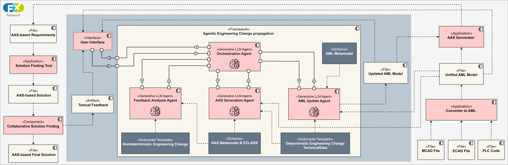

# 🔗 Agentic LLM-Based Engineering Change Propagation

> Enabling interoperable, semantically consistent, and automated engineering change management within the Industry 4.0 ecosystem.

---

## 📖 Overview

Interoperability and semantic consistency are fundamental requirements for collaborative engineering in the **Industry 4.0** paradigm. Engineering Changes (ECs) play a central role in enabling communication and coordination among stakeholders across heterogeneous engineering tools and domains.

This project presents an approach for:

- Modeling Engineering Changes using the **Asset Administration Shell (AAS)** standard
- Transforming unstructured textual engineering feedback into **semantically structured and deterministic AAS-based changes**
- Leveraging **agentic Large Language Models (LLMs)** to automate engineering change propagation
- Integrating external tools and services to maintain a unified engineering project model
- Enabling interoperable and intelligent engineering workflows across distributed toolchains

The proposed workflow demonstrates how agentic AI systems can support standardized engineering collaboration and automated change propagation in modern industrial environments.

The approach has been validated using a real-world use case from the **Factory-X** project.

---

## 🖼️ Architecture & Workflow

---

## 🚀 Key Features

- ✅ AAS-based Engineering Change representation
- ✅ Semantic transformation of textual engineering feedback
- ✅ Agentic LLM orchestration for deterministic change processing
- ✅ Integration with external engineering tools and services
- ✅ Interoperable Industry 4.0 engineering workflows
- ✅ Unified project model synchronization

---

## 🧩 Technologies Used

| Technology | Description |
|------------|-------------|
| **AutomationML (AML)** | XML-based standard for engineering data exchange |
| **Asset Administration Shell (AAS)** | Digital representation of assets in Industry 4.0 |
| **Python 3.9+** | Core implementation language |
| **LangChain** | Agent orchestration and LLM workflows |
| **Ollama** | Local LLM deployment and inference |

---

## 🏭 Industry 4.0 Context

This project contributes to the realization of:

- Interoperable engineering ecosystems
- Intelligent engineering assistants
- Automated change propagation pipelines
- Semantic digital twins
- Collaborative engineering environments

By combining standardized industrial data models with agentic AI systems, the approach supports scalable and future-proof engineering infrastructures.

---

## 📂 Project Goals

The repository aims to demonstrate:

1. **Modeling engineering changes** using standardized AAS structures  
2. **Extracting semantic meaning** from natural language engineering feedback  
3. **Automating change propagation** across engineering models  
4. **Integrating heterogeneous engineering tools** into a unified workflow  
5. **Applying agentic LLM systems** in industrial engineering scenarios  

---

## 📬 Contact

Have questions, collaboration ideas, or need further information? We'd be happy to hear from you!

<table>
<tr>
<td width="33%" valign="top">

### 👨‍💻 Hesam Rezaee Ahvanouee
**Ruhr University Bochum**

📧 **Email:**  
[hesam.rezaeeahvanouee@rub.de](mailto:hesam.rezaeeahvanouee@rub.de)

</td>
<td width="33%" valign="top">

### 👨‍🎓 Jingxi Zhang, M.Sc.
**University of Stuttgart**

📧 **Email:**  
[jingxi.zhang@isw.uni-stuttgart.de](mailto:jingxi.zhang@isw.uni-stuttgart.de)

</td>
<td width="33%" valign="top">

### 👨‍🔬 Marcel Auer, M.Sc.
**Karlsruhe Institute of Technology (KIT)**

📧 **Email:**  
[marcel.auer@kit.edu](mailto:marcel.auer@kit.edu)

</td>
</tr>
</table>

